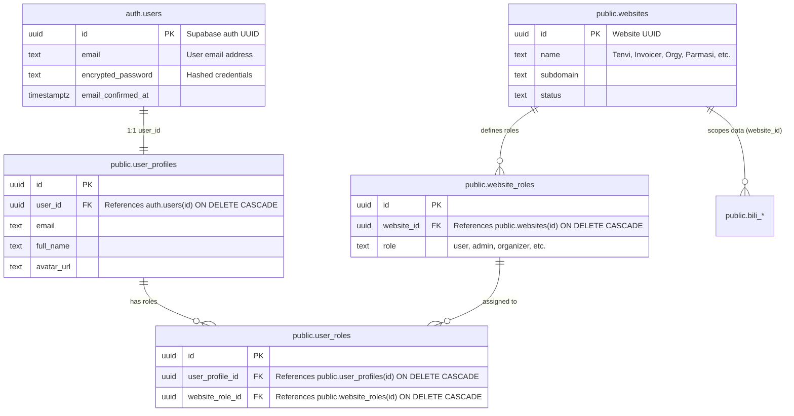
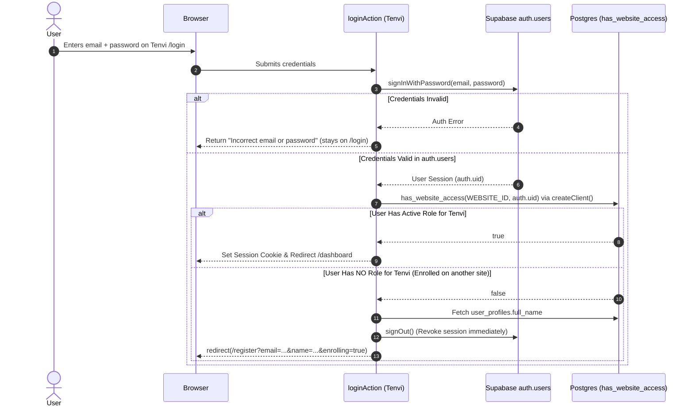
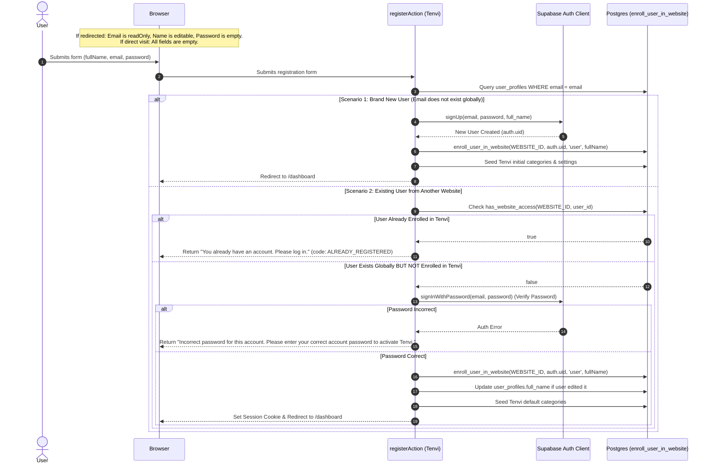

# Multi-Website Authentication & Authorization Architecture Specification

> **Scope**: Standardized specification and implementation blueprint for shared-database multi-website authentication across independent web applications (`Tenvi`, `Invoicer`, `Orgy`, `Parmasi`, `Denti`, etc.) using Supabase Auth and multi-tenant Role-Based Access Control (RBAC).  
> **Status**: Implemented, Cloud-Hardened & Verified in Tenvi  
> **Version**: 2.1 (Cross-Enrollment UX & Cloud-Resilient)  
> **Target Audience**: AI Agents, Backend/Full-Stack Engineers, DevOps

---

## 1. Executive Summary & Problem Definition

In our multi-tenant architecture, multiple distinct web applications share a single Supabase PostgreSQL database. While identity credentials (`auth.users`) and user profile data (`public.user_profiles`) are centralized, **authorization, roles, and domain data are strictly isolated per website (`public.websites`)**.

### 1.1 The Core Dilemma in Shared-Database Auth
Because `auth.users` is global to the entire Supabase project:
1. **Accidental Cross-Site Access**: When a user registers on **Website 1** (`Orgy` or `Invoicer`), their credentials exist globally in `auth.users`. If **Website 2** (`Tenvi`) naively verifies credentials using standard `supabase.auth.signInWithPassword()`, authentication succeeds at the identity layer. If Website 2 does not verify website-specific authorization, **User 1 gains access to Website 2 without ever registering for it.**
2. **Registration Deadlock**: If User 1 then visits Website 2's registration page (`/register`), standard `supabase.auth.signUp()` throws `"User already registered"`, blocking the user from joining Website 2.
3. **Flawed Auto-Role Provisioning**: Naive login actions that auto-create a user role or seed tenant data upon successful password verification violate tenant boundaries and allow any user in the database to enter any connected website.

### 1.2 Mandatory Business Rules
1. **Strict Website Login Isolation with Seamless Redirection**:  
   If User 1 registered on Website 1, they **can only log in directly to Website 1**. If they attempt to log into Website 2 (`Tenvi`) with valid network credentials:
   - Their identity is confirmed at the auth layer.
   - Any active session on Website 2 is immediately revoked (`signOut()`).
   - The user is automatically redirected to `/register?email=...&name=...&enrolling=true`.
2. **Pre-Populated Cross-Website Enrollment UX**:  
   When redirected to `/register`:
   - **Email**: Pre-populated and **`readOnly`** with a `"Linked Account"` badge (cannot be modified).
   - **Full Name**: Pre-populated from their network profile, but remains **editable** (if changed, the new name updates `user_profiles.full_name`).
   - **Password**: Kept **empty**. The user must confirm their existing platform password before website enrollment is granted.
   - **Unconnected Visitors**: Direct visits or failed credentials leave all registration fields **completely empty**.
3. **No Automatic Role Assignment on Login**:  
   Logging in must **never** create `user_roles` or auto-enroll a user into a website. Only explicit registration/enrollment with credential verification may grant website membership.
4. **Cloud-Resilient Defense in Depth**:  
   Website membership must be validated at every layer without depending solely on elevated service role keys:
   - **Database (RLS & Stored Functions)**: Central `SECURITY DEFINER` functions `has_website_access()` and `enroll_user_in_website()`. Granted to `authenticated`, `anon`, and `service_role`.
   - **Standard Client RPC First**: Membership checks execute via `createClient()` (anon key) first. Even if `SUPABASE_SERVICE_ROLE_KEY` is not present in cloud environments like Vercel, the check succeeds reliably.
   - **UUID Sanitization**: Environment variables (`WEBSITE_ID`, `DEFAULT_ROLE_ID`) are automatically stripped of surrounding quotes (`"` or `'`) and whitespace to eliminate PostgreSQL `22P02 invalid input syntax for type uuid` errors.
   - **Layout Guard**: Authoritative Server Component gate in `dashboard/layout.tsx`.
   - **Server Actions**: `requireWebsiteUser()` verifying identity + website membership before running mutations.

---

## 2. Multi-Website Relational Data Model



### 2.1 Registered Websites in Shared Database
| Website Name | Website ID (`WEBSITE_ID`) | Default User Role ID (`DEFAULT_ROLE_ID`) | Primary Domain / Purpose |
|---|---|---|---|
| **Tenvi** (formerly Bili) | `65d4f86e-1829-417a-981f-bc7aad7bc953` | `02bf8818-b503-4f94-beac-6c45aa12e368` | Personal Wealth & Float Ledger |
| **Invoicer** | `e602fc2e-7b59-4ce2-a409-ef72f5955ff2` | `bb2e25be-9979-429a-a059-d15436165620` | Invoicing & Client Management |
| **Orgy** | `e4a3b8d1-7c9f-42e5-a6b1-0f8d9c2e3b4a` | `22222222-2222-2222-2222-222222222222` | Tour & Travel Operations |
| **Parmasi** | `552b43bd-0312-4de1-89de-a6bc77738717` | `eeadcb63-0c03-4dce-a83f-2d212465890a` | Pharmacy & Facility Admin |
| **Denti** | `789abe58-74bf-4caa-86ce-615e8ce216e1` | `66e9928c-007b-49e6-8b82-7514f6410e1c` | Dental Clinic Operations |

---

## 3. End-to-End Architectural Flows

### 3.1 Website-Specific Login Flow (`loginAction`)



### 3.2 Pre-Populated Registration & Cross-Site Enrollment Flow (`registerAction`)



---

## 4. Cloud Resilience & Infrastructure Hardening (Vercel / Production)

Deploying a multi-tenant shared-database architecture across cloud providers like Vercel introduced key edge cases that have been resolved and codified:

### 4.1 Anonymous RPC First (`SECURITY DEFINER`)
- **Problem**: In cloud environments, `SUPABASE_SERVICE_ROLE_KEY` is often omitted in frontend preview branches or misconfigured, causing `createAdminClient()` to throw uncaught runtime exceptions during membership checks.
- **Solution**: `public.has_website_access` is defined as `SECURITY DEFINER` and granted to `anon` and `authenticated`. `checkUserWebsiteMembership()` executes through `createClient()` (anon key) first. It only falls back to `createAdminClient()` if available, wrapped safely in a `try/catch`.

### 4.2 UUID Sanitization (`sanitizeUuid`)
- **Problem**: Copying and pasting UUIDs into Vercel dashboard environment variables frequently introduces wrapping quotes (`"65d4f86e-..."` or `'65d4f86e-...'`) or trailing whitespace. When passed to PostgreSQL typed parameters (`p_website_id uuid`), Postgres rejects the request with code `22P02: invalid input syntax for type uuid`.
- **Solution**: [src/lib/constants.ts](file:///Users/jeunciano/Workstation/Bili/src/lib/constants.ts) runs `sanitizeUuid()` on both `WEBSITE_ID` and `DEFAULT_ROLE_ID`. Any quotes or trailing spaces are stripped, and a strict UUID regex validates the string. If invalid, it automatically falls back to canonical defaults (`65d4f86e-1829-417a-981f-bc7aad7bc953`).

### 4.3 Dynamic Serverless Config Resolution
- **Problem**: When environment variables are read at module scope outside functions in `server.ts`, serverless function containers may capture empty strings during build/cold start.
- **Solution**: [src/lib/supabase/server.ts](file:///Users/jeunciano/Workstation/Bili/src/lib/supabase/server.ts) uses `getSupabaseServerConfig()` called dynamically inside each function invocation.

---

## 5. Universal Implementation Blueprint for Other Projects

Any developer or AI agent implementing this multi-tenant auth architecture on another project (`Invoicer`, `Orgy`, `Parmasi`, `Denti`, etc.) should follow these standardized steps:

### Step 1: Environment & Constants Configuration
In the target project's `src/lib/constants.ts`, define and sanitize the target website's constants:
```typescript
export const TARGET_WEBSITE_ID = 'e602fc2e-7b59-4ce2-a409-ef72f5955ff2';
export const TARGET_DEFAULT_ROLE_ID = 'bb2e25be-9979-429a-a059-d15436165620';

function sanitizeUuid(val: string | undefined, fallback: string): string {
  if (!val) return fallback;
  const cleaned = val.trim().replace(/^["']|["']$/g, '').trim();
  const uuidRegex = /^[0-9a-f]{8}-[0-9a-f]{4}-[0-9a-f]{4}-[0-9a-f]{4}-[0-9a-f]{12}$/i;
  return uuidRegex.test(cleaned) ? cleaned : fallback;
}

export const WEBSITE_ID = sanitizeUuid(
  process.env.NEXT_PUBLIC_WEBSITE_ID || process.env.WEBSITE_ID,
  TARGET_WEBSITE_ID
);

export const DEFAULT_ROLE_ID = sanitizeUuid(
  process.env.NEXT_PUBLIC_DEFAULT_ROLE_ID || process.env.DEFAULT_ROLE_ID,
  TARGET_DEFAULT_ROLE_ID
);

export const APP_NAME = 'Invoicer'; // or Orgy, Parmasi, etc.
```

### Step 2: Auth Guards Helper (`src/lib/auth/guards.ts`)
Copy the cloud-hardened `checkUserWebsiteMembership` and `requireWebsiteUser` functions from [src/lib/auth/guards.ts](file:///Users/jeunciano/Workstation/Bili/src/lib/auth/guards.ts). Ensure:
- It calls `supabase.rpc('has_website_access')` via standard client first.
- Admin client calls are wrapped in `try/catch`.

### Step 3: Implement `loginAction` with Auto-Redirect
In `src/app/actions/auth.ts`:
```typescript
export async function loginAction(prevState: any, formData: FormData) {
  const email = (formData.get('email') as string)?.trim().toLowerCase();
  const password = formData.get('password') as string;

  const supabase = await createClient();
  const { data, error } = await supabase.auth.signInWithPassword({ email, password });
  if (error || !data.user) {
    return { error: error?.message || 'Incorrect email or password' };
  }

  const isEnrolled = await checkUserWebsiteMembership(data.user.id, WEBSITE_ID);
  if (!isEnrolled) {
    let fullName = (data.user.user_metadata?.full_name as string) || '';
    try {
      if (process.env.SUPABASE_SERVICE_ROLE_KEY) {
        const admin = createAdminClient();
        const { data: profile } = await admin
          .from('user_profiles')
          .select('full_name')
          .eq('user_id', data.user.id)
          .maybeSingle();
        if (profile?.full_name) fullName = profile.full_name;
      }
    } catch {
      // Safe fallback
    }

    await supabase.auth.signOut();
    const params = new URLSearchParams({
      email,
      ...(fullName ? { name: fullName } : {}),
      enrolling: 'true',
    });
    redirect(`/register?${params.toString()}`);
  }

  redirect('/dashboard');
}
```

### Step 4: Implement `registerAction` with Cross-Site Enrollment
In `src/app/actions/auth.ts`:
```typescript
export async function registerAction(prevState: any, formData: FormData) {
  const fullName = (formData.get('fullName') as string)?.trim();
  const email = (formData.get('email') as string)?.trim().toLowerCase();
  const password = formData.get('password') as string;

  const admin = createAdminClient();
  const supabase = await createClient();

  const { data: existingProfile } = await admin
    .from('user_profiles')
    .select('id, user_id, full_name')
    .eq('email', email)
    .maybeSingle();

  if (existingProfile) {
    const isEnrolled = await checkUserWebsiteMembership(existingProfile.user_id, WEBSITE_ID);
    if (isEnrolled) {
      return { error: 'You already have an account. Please log in instead.', code: 'ALREADY_REGISTERED' };
    }

    // Verify existing password
    const { data: authData, error: authErr } = await supabase.auth.signInWithPassword({ email, password });
    if (authErr || !authData.user) {
      return {
        error: 'Incorrect password for this account. Please enter your correct account password to activate access.',
        code: 'EXISTING_ACCOUNT_PASSWORD_REQUIRED',
      };
    }

    // Enroll into target website
    await enrollUserInWebsite(authData.user.id, email, fullName || existingProfile.full_name || '');
    redirect('/dashboard');
  }

  // Brand new user sign-up
  const { data: signUpData, error: signUpErr } = await supabase.auth.signUp({
    email,
    password,
    options: { data: { full_name: fullName } },
  });
  if (signUpErr) return { error: signUpErr.message };

  if (signUpData.user) {
    await enrollUserInWebsite(signUpData.user.id, email, fullName);
  }
  redirect('/dashboard');
}
```

### Step 5: Guard Layout (`src/app/dashboard/layout.tsx`)
In the protected dashboard layout, verify membership immediately after confirming identity:
```typescript
import { createClient } from '@/lib/supabase/server';
import { redirect } from 'next/navigation';
import { checkUserWebsiteMembership } from '@/lib/auth/guards';
import { WEBSITE_ID } from '@/lib/constants';

export default async function DashboardLayout({ children }: { children: React.ReactNode }) {
  const supabase = await createClient();
  const { data: { user } } = await supabase.auth.getUser();

  if (!user) {
    redirect('/login');
  }

  // Authoritative authorization gate
  const isEnrolled = await checkUserWebsiteMembership(user.id, WEBSITE_ID);
  if (!isEnrolled) {
    const userEmail = user.email || '';
    const userName = (user.user_metadata?.full_name as string) || '';

    // Revoke foreign session and redirect to registration with pre-populated details
    await supabase.auth.signOut();
    const params = new URLSearchParams({
      email: userEmail,
      ...(userName ? { name: userName } : {}),
      enrolling: 'true',
    });
    redirect(`/register?${params.toString()}`);
  }

  return <>{children}</>;
}
```

### Step 6: Registration UI Component (`src/app/(auth)/register/page.tsx`)
The registration UI must handle pre-populated query parameters gracefully:
```tsx
'use client';

import { useActionState } from 'react';
import { useSearchParams } from 'next/navigation';
import { registerAction } from '@/app/actions/auth';
import { Lock, Mail, User, AlertCircle, Info, ShieldAlert } from 'lucide-react';

export default function RegisterForm() {
  const [state, formAction, isPending] = useActionState(registerAction, null);
  const searchParams = useSearchParams();

  const urlEmail = searchParams.get('email')?.trim() || '';
  const urlName = searchParams.get('name')?.trim() || '';
  const isEnrolling = searchParams.get('enrolling') === 'true' || Boolean(urlEmail);

  return (
    <form action={formAction} className="space-y-5">
      {/* Alert Banner: Connected Account Detected */}
      {isEnrolling && !state?.error && (
        <div className="p-4 rounded-2xl bg-blue-50 text-blue-900 border border-blue-200 text-sm">
          <div className="font-semibold flex items-center gap-1.5 mb-1">
            <ShieldAlert className="w-4 h-4 text-blue-600" />
            Connected Account Detected
          </div>
          <p className="text-xs text-blue-800">
            Your credentials belong to an account on our platform. Please confirm your account
            password below to link and activate access.
          </p>
        </div>
      )}

      {/* Full Name: Pre-populated & Editable */}
      <div>
        <label className="block text-xs font-semibold text-slate-700 uppercase">Your Full Name</label>
        <input
          name="fullName"
          type="text"
          required
          defaultValue={urlName}
          className="w-full border rounded-xl px-4 py-3"
        />
        {isEnrolling && (
          <p className="text-[11px] text-slate-400 mt-1">
            Pre-filled from your profile. You can edit this name.
          </p>
        )}
      </div>

      {/* Email: Pre-populated & ReadOnly (NOT disabled, so FormData includes it) */}
      <div>
        <label className="block text-xs font-semibold text-slate-700 uppercase">Email Address</label>
        <input
          name="email"
          type="email"
          required
          readOnly={isEnrolling}
          defaultValue={urlEmail}
          className={`w-full border rounded-xl px-4 py-3 ${
            isEnrolling ? 'bg-slate-100 text-slate-600 cursor-not-allowed select-none' : ''
          }`}
        />
        {isEnrolling && (
          <p className="text-[11px] text-slate-400 mt-1">
            Locked to your verified platform account email.
          </p>
        )}
      </div>

      {/* Password: Always empty. Dynamic label */}
      <div>
        <label className="block text-xs font-semibold text-slate-700 uppercase">
          {isEnrolling ? 'Confirm Account Password' : 'Password'}
        </label>
        <input
          name="password"
          type="password"
          required
          placeholder="••••••••"
          className="w-full border rounded-xl px-4 py-3"
        />
      </div>

      <button type="submit" disabled={isPending} className="w-full py-3 bg-indigo-600 text-white font-medium rounded-xl">
        {isPending ? 'Processing...' : isEnrolling ? 'Link Account & Join' : 'Create Account'}
      </button>
    </form>
  );
}
```
> [!CRITICAL]
> **Use `readOnly` instead of `disabled` for pre-populated inputs**. In HTML specification, form inputs marked as `disabled` are omitted from the form submission payload (`FormData`), causing `formData.get('email')` to return `null` on the server!

### Step 7: Guard Server Actions
Add `const auth = await requireWebsiteUser();` at the beginning of mutating Server Actions:
```typescript
export async function createTransactionAction(data: TransactionInput) {
  const auth = await requireWebsiteUser();
  if (!auth.isAuthorized || !auth.user) {
    return { error: auth.error || 'Unauthorized' };
  }
  
  // Proceed with safe mutation scoped to auth.user.id and WEBSITE_ID
}
```

---

## 6. Security & Operational FAQ

### Q1: What happens if a user changes their password?
Because `auth.users` holds credentials globally, changing the password updates the password for all enrolled websites. However, authorization (whether they can access Website A, Website B, or Website C) remains strictly governed by `user_roles`.

### Q2: What happens if a user is removed or deleted from one website?
Deleting a user from **Website 1** deletes only their `user_roles` row for Website 1 (and cascades domain tables linked by `website_id`). Their global account in `auth.users` and their membership in **Website 2** remain completely untouched.

### Q3: How are session cookies isolated if websites run on different domains?
- **Distinct Domains** (`tenvi.app` vs `invoicer.app`): Standard browser cookie jar partitioning guarantees sessions never leak across distinct domain names.
- **Shared Subdomains** (`tenvi.domain.com` vs `invoicer.domain.com`): Configure `@supabase/ssr` cookies without a wildcard `Domain=.domain.com` attribute so cookies are host-only.

### Q4: Why does `checkUserWebsiteMembership` check via the standard client first instead of admin client?
`public.has_website_access` is a PostgreSQL `SECURITY DEFINER` function explicitly granted to `anon` and `authenticated`. Executing it via `createClient()` (anon key) means authorization checks work reliably in preview deployments, local staging, and production environments where `SUPABASE_SERVICE_ROLE_KEY` might not be provided or needed.

### Q5: What causes "invalid input syntax for type uuid" errors on Vercel?
Copying and pasting UUIDs into cloud platform dashboards often introduces wrapping quotes (e.g. `"65d4f86e-..."`) or trailing newlines. When passed as a query parameter into PostgreSQL, PostgreSQL cannot cast a quoted string into a native `UUID`. Our `sanitizeUuid()` utility strips quotes and whitespace automatically.

---

## 7. QA & Verification Test Matrix

When testing this auth system or rolling it out to a new website, run through these test scenarios:

| # | Test Scenario | Steps | Expected Result |
|---|---|---|---|
| 1 | **Brand New User Registration** | Visit `/register` directly. Enter new email, name, password. | Form fields empty initially. User created in `auth.users`, `user_profiles`, and `user_roles` (for target `WEBSITE_ID`). Redirected to `/dashboard`. |
| 2 | **Cross-Site User Login Attempt** | User registered on *Invoicer* attempts to log into *Tenvi* at `/login`. | Credentials match in `auth.users`. Tenvi role check returns `false`. Session revoked immediately. Auto-redirected to `/register?email=...&name=...&enrolling=true`. |
| 3 | **Cross-Site Enrollment Form State** | Inspect `/register` after redirect from Test 2. | **Email** is pre-populated & `readOnly`. **Name** is pre-populated & editable. **Password** is empty with label "Confirm Account Password". "Connected Account Detected" alert is displayed. |
| 4 | **Cross-Site Enrollment with Wrong Password** | On `/register` from Test 3, submit an incorrect password. | Error message: *"Incorrect password for this account. Please enter your correct account password to activate access."* User remains on registration page; no role created. |
| 5 | **Cross-Site Enrollment with Correct Password** | On `/register` from Test 3, submit the correct platform password (and optionally change name). | Password verified via `signInWithPassword()`. New row inserted in `user_roles` linking user to target website. If name was edited, `user_profiles.full_name` is updated. Redirected to `/dashboard`. |
| 6 | **Enrolled User Subsequent Login** | User from Test 5 logs out and logs back in via `/login`. | Login succeeds immediately. User role confirmed. Redirected directly to `/dashboard`. |
| 7 | **Direct Access via URL manipulation** | Unenrolled authenticated user attempts to browse directly to `/dashboard`. | Intercepted by `dashboard/layout.tsx`. Role check fails. Session revoked. Redirected to `/register?email=...&name=...&enrolling=true`. |
| 8 | **Quoted Environment Variables on Vercel** | Set `WEBSITE_ID="65d4f86e-1829-417a-981f-bc7aad7bc953"` with quotes. | `sanitizeUuid()` strips quotes. No PostgreSQL `22P02` syntax errors. |

