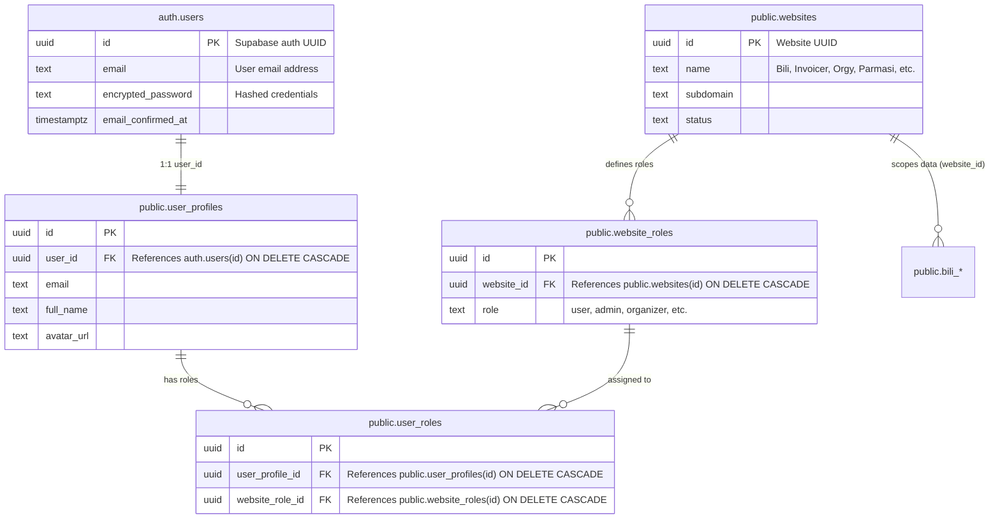
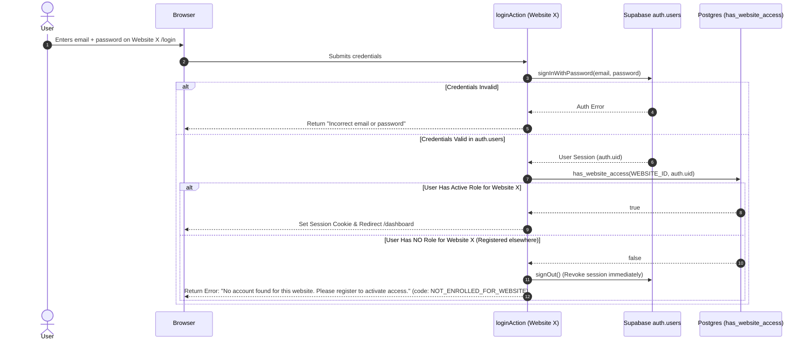
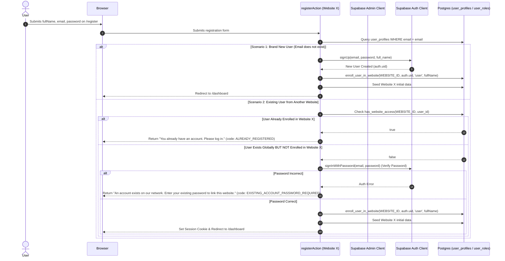

# Multi-Website Authentication & Authorization Architecture Specification

> **Scope**: Standardized specification and implementation blueprint for shared-database multi-website authentication across independent web applications (`Tenvi`, `Invoicer`, `Orgy`, `Parmasi`, `Denti`, etc.) using Supabase Auth and multi-tenant Role-Based Access Control (RBAC).  
> **Status**: Implemented & Verified in Tenvi  
> **Version**: 2.0 (Production-Ready)  
> **Target Audience**: AI Agents, Backend/Full-Stack Engineers, DevOps

---

## 1. Executive Summary & Problem Definition

In our multi-tenant architecture, multiple distinct web applications share a single Supabase PostgreSQL database. While identity credentials (`auth.users`) and user profile data (`public.user_profiles`) are centralized, **authorization, roles, and domain data are strictly isolated per website (`public.websites`)**.

### 1.1 The Core Dilemma in Shared-Database Auth
Because `auth.users` is global to the entire Supabase project:
1. **Accidental Cross-Site Access**: When a user registers on **Website 1** (`Orgy` or `Invoicer`), their credentials exist globally in `auth.users`. If **Website 2** (`Tenvi`) naively verifies credentials using standard `supabase.auth.signInWithPassword()`, authentication succeeds at the identity layer. If Website 2 does not verify website-specific authorization, **User 1 gains access to Website 2 without ever registering for it.**
2. **Registration Deadlock**: If User 1 then visits Website 2's registration page (`/register`), standard `supabase.auth.signUp()` throws `"User already registered"`, blocking the user from joining Website 2.
3. **Flawed Auto-Role Provisioning**: Naive login actions that auto-create a user role or seed tenant data upon successful password verification violate tenant boundaries and allow any user in the database to enter any connected website.

### 1.2 Mandatory Business Rules
1. **Strict Website Login Isolation**:  
   If User 1 registered on Website 1, they **can only log in to Website 1**. Attempting to log into Website 2 must be **actively blocked**, any temporary session immediately destroyed, and an actionable notice displayed directing them to register.
2. **Explicit Multi-Website Enrollment**:  
   User 1 **must explicitly register/enroll for Website 2** before gaining access to Website 2.
3. **No Automatic Role Assignment on Login**:  
   Logging in must **never** create `user_roles` or auto-enroll a user into a website. Only the registration/enrollment flow may grant website membership.
4. **Defense in Depth**:  
   Website membership must be validated at every layer:
   - **Database (RLS & Stored Functions)**: Central functions `has_website_access()` and `enroll_user_in_website()`.
   - **Login Action**: Immediate sign-out and rejection if no role exists for the current website.
   - **Registration Action**: Password-verified cross-site enrollment engine.
   - **Layout Guard**: Authoritative Server Component gate in `dashboard/layout.tsx`.
   - **Server Actions**: `requireWebsiteUser()` verifying identity + website membership before running mutations.

---

## 2. Multi-Website Relational Data Model



### 2.1 Registered Websites in Shared Database
| Website Name | Website ID (`WEBSITE_ID`) | Default User Role ID (`DEFAULT_ROLE_ID`) | Primary Domain / Purpose |
|---|---|---|---|
| **Tenvi** (formerly Bili) | `65d4f86e-1829-417a-981f-bc7aad7bc953` | `02bf8818-b503-4f94-beac-6c45aa12e368` | Personal Wealth & Float Ledger |
| **Invoicer** | `e602fc2e-7b59-4ce2-a409-ef72f5955ff2` | `bb2e25be-9979-429a-a059-d15436165620` | Invoicing & Client Management |
| **Orgy** | `e4a3b8d1-7c9f-42e5-a6b1-0f8d9c2e3b4a` | `22222222-2222-2222-2222-222222222222` | Tour & Travel Operations |
| **Parmasi** | `552b43bd-0312-4de1-89de-a6bc77738717` | `eeadcb63-0c03-4dce-a83f-2d212465890a` | Pharmacy & Facility Admin |
| **Denti** | `789abe58-74bf-4caa-86ce-615e8ce216e1` | `66e9928c-007b-49e6-8b82-7514f6410e1c` | Dental Clinic Operations |

---

## 3. End-to-End Architectural Flows

### 3.1 Website-Specific Login Flow (`loginAction`)



### 3.2 Website-Specific Registration & Enrollment Flow (`registerAction`)



---

## 4. Detailed Tasks & Deliverables by Phase

### Phase 1: Database Foundation & Stored Procedures
**Objective**: Guarantee that access checks and cross-site enrollment logic are atomic, secure, and centralized in PostgreSQL with security-definer privileges.

#### Tasks:
- [x] **Task 1.1**: Verify table schemas and foreign key cascades (`public.websites`, `public.website_roles`, `public.user_profiles`, `public.user_roles`).
- [x] **Task 1.2**: Ensure unique constraint `UNIQUE (user_profile_id, website_role_id)` on `public.user_roles` to prevent duplicate role assignments.
- [x] **Task 1.3**: Create and deploy security-definer function `public.has_website_access(p_website_id uuid, p_user_id uuid)`.
- [x] **Task 1.4**: Create and deploy security-definer function `public.enroll_user_in_website(p_website_id uuid, p_user_id uuid, p_role_name text, p_full_name text)`.
- [x] **Task 1.5**: Grant execution rights on functions to `authenticated`, `anon`, and `service_role`.

#### Deliverables:
1. `supabase/migrations/20260929_multi_website_auth_helpers.sql`: Clean, version-controlled DDL migration.
2. Verified DB functions in production Supabase database.

---

### Phase 2: Core Server Action Logic & Enrollment Engine
**Objective**: Refactor authentication server actions to enforce strict website membership on login and provide a password-verified enrollment pathway on registration.

#### Tasks:
- [x] **Task 2.1**: Implement `checkUserWebsiteMembership(userId, websiteId)` in `@/lib/auth/guards.ts`.
- [x] **Task 2.2**: Update `loginAction` in `src/app/actions/auth.ts`:
  - Authenticate identity with `signInWithPassword()`.
  - Authorize website membership via `checkUserWebsiteMembership()`.
  - If unauthorized: call `supabase.auth.signOut()` immediately and return `{ code: 'NOT_ENROLLED_FOR_WEBSITE' }`.
  - Remove all legacy auto-role creation code from login.
- [x] **Task 2.3**: Update `registerAction` in `src/app/actions/auth.ts`:
  - Check for existing global account in `user_profiles`.
  - If existing account is already enrolled in Tenvi, return `{ code: 'ALREADY_REGISTERED' }`.
  - If existing account is not enrolled in Tenvi, verify credentials via `signInWithPassword()`. If valid, call `enroll_user_in_website()`, seed initial data, and grant access.
  - If brand new user, call `signUp()`, call `enroll_user_in_website()`, seed initial data, and grant access.
- [x] **Task 2.4**: Implement robust RPC fallback to direct insertion in case of network or function timeout.

#### Deliverables:
1. Updated `src/app/actions/auth.ts` with strict isolation and enrollment engine.
2. Helper functions in `src/lib/auth/guards.ts`.

---

### Phase 3: Route, Layout & Action Security Guards
**Objective**: Build defense-in-depth protection ensuring that foreign sessions cannot access protected pages or trigger backend mutations.

#### Tasks:
- [x] **Task 3.1**: Implement `requireWebsiteUser()` in `src/lib/auth/guards.ts`.
- [x] **Task 3.2**: Update Server Component layout guard in `src/app/dashboard/layout.tsx`:
  - Check `checkUserWebsiteMembership(user.id, WEBSITE_ID)`.
  - If false: execute `supabase.auth.signOut()` and redirect to `/login?error=not_enrolled`.
- [x] **Task 3.3**: Update Next.js edge proxy in `src/proxy.ts`:
  - Prevent redirect loops between `/dashboard` and `/login` when `?error=not_enrolled` is present.
- [x] **Task 3.4**: Integrate `requireWebsiteUser()` into critical Server Actions:
  - `src/app/actions/transactions.ts` (`createTransactionAction`, `deleteTransactionAction`).
  - `src/app/actions/cards.ts` (`createCreditCardAction`, `updateCreditCardAction`, `deleteCreditCardAction`).

#### Deliverables:
1. `src/lib/auth/guards.ts` (reusable guard library).
2. Authoritative gate in `src/app/dashboard/layout.tsx`.
3. Loop-proof middleware in `src/proxy.ts`.
4. Hardened Server Actions in `transactions.ts` and `cards.ts`.

---

### Phase 4: UI Error Handling & User Experience Polish
**Objective**: Present clear, non-confusing messaging when an ecosystem user attempts to log into or register for a website they are not yet enrolled in.

#### Tasks:
- [x] **Task 4.1**: Update `src/app/(auth)/login/page.tsx`:
  - Wrap login component in `<Suspense>` for search parameter safety.
  - Catch `state?.code === 'NOT_ENROLLED_FOR_WEBSITE'` and `?error=not_enrolled`.
  - Render an amber callout with an active link to `/register`.
- [x] **Task 4.2**: Update `src/app/(auth)/register/page.tsx`:
  - Catch `state?.code === 'ALREADY_REGISTERED'` and render an informative banner with link to `/login`.
  - Catch `state?.code === 'EXISTING_ACCOUNT_PASSWORD_REQUIRED'` and render a blue banner explaining that their global account was detected and entering their existing password will activate access.

#### Deliverables:
1. Updated `src/app/(auth)/login/page.tsx` with contextual enrollment alert.
2. Updated `src/app/(auth)/register/page.tsx` with ecosystem account detection banner.

---

### Phase 5: Verification, Multi-Tenant Testing & Validation
**Objective**: Validate all paths using automated compiler checks, unit tests, and cross-site manual validation.

#### Tasks:
- [x] **Task 5.1**: Run `npx tsc --noEmit` to verify type safety across all modified files.
- [x] **Task 5.2**: Test Case 1: Attempt to log in with an email registered exclusively on another site (`Orgy` or `Invoicer`). Verify login is rejected and redirected with message.
- [x] **Task 5.3**: Test Case 2: Register on Tenvi with that same cross-site email. Verify password verification succeeds, role is assigned, and dashboard loads.
- [x] **Task 5.4**: Test Case 3: Verify the user can now log into both websites independently.

#### Deliverables:
1. TypeScript compilation passing with 0 errors.
2. Complete end-to-end verification report.

---

## 5. Universal Implementation Blueprint for Other Projects

Any developer or AI agent implementing this multi-tenant auth architecture on another project (`Invoicer`, `Orgy`, `Parmasi`, `Denti`, etc.) should follow these standardized steps:

### Step 1: Environment & Constants Configuration
In the target project's `src/lib/constants.ts` (or `.env.local`), define the target website's constants:
```typescript
export const WEBSITE_ID = process.env.NEXT_PUBLIC_WEBSITE_ID || '<TARGET_WEBSITE_UUID>';
export const DEFAULT_ROLE_ID = process.env.NEXT_PUBLIC_DEFAULT_ROLE_ID || '<TARGET_DEFAULT_ROLE_UUID>';
export const APP_NAME = 'Invoicer'; // or Orgy, Parmasi, etc.
```

### Step 2: Drop In Auth Guards Helper
Copy `src/lib/auth/guards.ts` into the target project. It uses `WEBSITE_ID` from constants and calls the shared `public.has_website_access()` database function.

### Step 3: Implement `loginAction`
In `src/app/actions/auth.ts`:
1. Authenticate identity with `supabase.auth.signInWithPassword()`.
2. Check `await checkUserWebsiteMembership(user.id, WEBSITE_ID)`.
3. If `!isEnrolled`:
   - Call `await supabase.auth.signOut()`.
   - Return `{ error: 'No account found for ' + APP_NAME, code: 'NOT_ENROLLED_FOR_WEBSITE' }`.
4. If enrolled: redirect to `/dashboard`.

### Step 4: Implement `registerAction`
In `src/app/actions/auth.ts`:
1. Check `user_profiles` for existing email.
2. If exists:
   - Check if already enrolled in this website. If so, return `{ code: 'ALREADY_REGISTERED' }`.
   - If not enrolled, verify password via `signInWithPassword()`.
   - If valid, execute `await enroll_user_in_website(WEBSITE_ID, user.id, 'user', fullName)`.
   - Seed target website initial data (e.g., invoice settings, default categories).
   - Redirect to `/dashboard`.
3. If new:
   - Call `supabase.auth.signUp()`.
   - Execute `enroll_user_in_website()`.
   - Seed initial data.
   - Redirect to `/dashboard`.

### Step 5: Guard Layout & Server Actions
1. Add the membership check in `src/app/dashboard/layout.tsx`.
2. Add `const auth = await requireWebsiteUser();` at the beginning of mutating Server Actions.

---

## 6. Security & Operational FAQ

### Q1: What happens if a user changes their password?
Because `auth.users` holds credentials globally, changing the password updates the password for all enrolled websites. However, their authorization (whether they can access Website A, Website B, or Website C) remains strictly governed by `user_roles`.

### Q2: What happens if a user is removed or deleted from one website?
Deleting a user from **Website 1** deletes only their `user_roles` row for Website 1 (and cascades domain tables linked by `website_id`). Their global account in `auth.users` and their membership in **Website 2** remain completely untouched.

### Q3: How are session cookies isolated if websites run on different domains?
- **Distinct Domains** (`tenvi.app` vs `invoicer.app`): Standard browser cookie jar partitioning guarantees sessions never leak across distinct domain names.
- **Shared Subdomains** (`tenvi.domain.com` vs `invoicer.domain.com`): Configure `@supabase/ssr` cookies without a wildcard `Domain=.domain.com` attribute so cookies are host-only.
