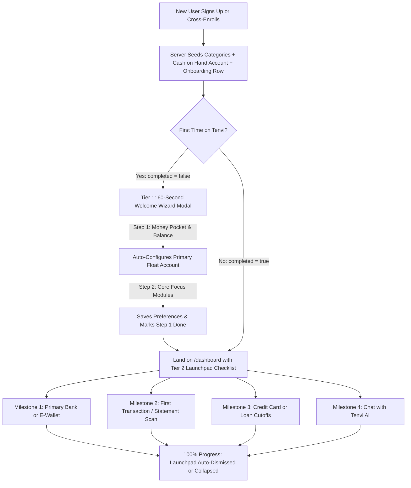

# User Onboarding Architecture & Implementation Specification

> **Scope**: Architecture, data model, component specifications, and user experience flows for first-time user onboarding in **Tenvi** and shared-database platform web apps (`Invoicer`, `Orgy`, `Parmasi`, `Denti`).  
> **Status**: Implemented & Production-Verified  
> **Target Audience**: AI Agents, Frontend/Full-Stack Engineers, Product Managers  

---

## 1. Executive Summary & Problem Definition

In personal finance and ledger applications, the **blank canvas dilemma** is the leading cause of user churn:
- When a user signs up and lands on `/dashboard`, balance metrics display `₱0.00`, charts are empty, and transaction lists show no records.
- Without immediate guidance, users do not know which action to take first (create an account, add a credit card, log an expense, or drop a statement).
- If creating an expense requires a pre-existing float account, users hit friction barriers (*"Please create an account first"*).

### The Solution: Hybrid 2-Tier Progressive Onboarding
To deliver value in under 90 seconds without fatiguing users with endless configuration forms, Tenvi implements a **Hybrid 2-Tier Progressive Onboarding system**:



---

## 2. Multi-Tenant Scoping & Database Schema

In a shared Supabase database (`Tenvi`, `Invoicer`, `Orgy`), a user's onboarding state in Tenvi must be **isolated per website (`website_id`)**. A user who has completed onboarding in Tenvi might still need onboarding when they first access Invoicer or Orgy.

### 2.1 Table: `public.bili_user_onboarding`
- **Location**: `supabase/migrations/20260930_create_bili_user_onboarding.sql`

```sql
CREATE TABLE IF NOT EXISTS public.bili_user_onboarding (
  id UUID PRIMARY KEY DEFAULT gen_random_uuid(),
  website_id UUID NOT NULL REFERENCES public.websites(id) ON DELETE CASCADE,
  user_id UUID NOT NULL REFERENCES auth.users(id) ON DELETE CASCADE,
  completed BOOLEAN NOT NULL DEFAULT FALSE,
  step INTEGER NOT NULL DEFAULT 1,
  dismissed_checklist BOOLEAN NOT NULL DEFAULT FALSE,
  has_added_account BOOLEAN NOT NULL DEFAULT FALSE,
  has_added_transaction BOOLEAN NOT NULL DEFAULT FALSE,
  has_added_card_or_loan BOOLEAN NOT NULL DEFAULT FALSE,
  has_tried_ai BOOLEAN NOT NULL DEFAULT FALSE,
  preferred_modules JSONB DEFAULT '["expenses", "cards"]'::jsonb,
  created_at TIMESTAMPTZ NOT NULL DEFAULT now(),
  updated_at TIMESTAMPTZ NOT NULL DEFAULT now(),
  CONSTRAINT uq_bili_user_onboarding_user_site UNIQUE (website_id, user_id)
);

CREATE INDEX IF NOT EXISTS idx_bili_user_onboarding_lookup
  ON public.bili_user_onboarding(website_id, user_id);

-- Row Level Security (RLS)
ALTER TABLE public.bili_user_onboarding ENABLE ROW LEVEL SECURITY;

CREATE POLICY "Users can view their own onboarding status"
  ON public.bili_user_onboarding FOR SELECT
  TO authenticated
  USING (user_id = auth.uid());

CREATE POLICY "Users can insert their own onboarding status"
  ON public.bili_user_onboarding FOR INSERT
  TO authenticated
  WITH CHECK (user_id = auth.uid());

CREATE POLICY "Users can update their own onboarding status"
  ON public.bili_user_onboarding FOR UPDATE
  TO authenticated
  USING (user_id = auth.uid());
```

---

## 3. The 2-Tier User Experience (Senior & Non-Techy Accessible)

### 3.1 Design Principles: Zero-Gradient & Non-Techy Accessibility
1. **No Gradients (Flat & High-Contrast)**:
   - Gradients introduce visual noise and lower contrast for older eyes. All onboarding surfaces use crisp solid backgrounds (`bg-white`, `bg-slate-900`, `bg-slate-50`), solid status indicators, and distinct 2px borders (`border-2 border-slate-200`).
2. **Zero Financial Jargon**:
   - Instead of *"Float account"*, we say *"Where do you keep your everyday spending money?"*.
   - Instead of *"Ledger balance"*, we say *"How much is in here right now? (Rough estimate is fine)"*.
   - Instead of *"Statement reconciliation"*, we say *"Scan a paper receipt or bank statement"*.
3. **Large Touch Targets & Legible Typography**:
   - Minimum button and card height: `48px` to `68px`.
   - Primary text sizes: `14px` to `24px` with clear, distinct weights.
4. **Tactile Micro-Animations**:
   - Card selection: gentle tactile scale feedback (`active:scale-[0.98] transition-transform duration-150`).
   - Checkmark reveals: instant pop-in animation (`animate-in zoom-in-75 duration-200`).
   - Step transitions: smooth slide-in (`animate-in fade-in slide-in-from-right-2 duration-200`).
   - Progress bar: smooth width transition (`transition-all duration-500 ease-out`).

---

### 3.2 Tier 1: The 60-Second Welcome Wizard (`WelcomeWizardModal.tsx`)
Rendered when a user enters `/dashboard` and `initialOnboarding.completed === false`.

- **Step 1: Your Everyday Money Pocket**
  - Big, easily tappable preset buttons:
    - 📱 **GCash** — *"Mobile wallet on your phone"*
    - 💳 **Maya** — *"Digital wallet & savings app"*
    - 💵 **Cash on Hand** — *"Paper bills & coins in your wallet"*
    - 🏦 **Bank Account** — *"BDO, BPI, Metrobank, etc."*
  - Nickname field with plain examples (e.g. *"My Main GCash, Wallet Cash"*).
  - Estimated balance field with large `₱` sign and quick-tap buttons: `₱0 (Start with zero)`, `₱1,000`, `₱5,000`, `₱10,000`.
- **Step 2: Choose What You Want Help With**
  - Plain English feature cards with big checkboxes:
    - 🛒 **Daily Expenses & Groceries**: *"Keep track of food, bills, shopping, and everyday receipts."*
    - 💳 **Credit Cards & Due Dates**: *"Get reminded before billing deadlines to avoid late fees."*
    - 🤝 **Borrowed & Lent Money**: *"Remember who owes you money or what loans you are paying."*
    - 🏠 **House, Car & Properties**: *"Keep track of your home value, vehicle, or rental properties."*
- **Finish / Skip**:
  - Primary button: *"Finish & Open Dashboard"* (calls `saveInitialSetupAction()`).
  - Secondary button: *"Skip for now"* (lets users explore freely).

---

### 3.3 Tier 2: The Dashboard "Launchpad" Checklist (`OnboardingLaunchpad.tsx`)
Docked at the top of `/dashboard` above financial summary cards:

- **Features**:
  - **Zero-Gradient Solid Styling**: White card with `border-2 border-slate-200` and high-contrast text.
  - **Dynamic Progress Bar**: Calculated in real-time (`25%`, `50%`, `75%`, `100%`) with smooth animation.
  - **Auto-Completion Awareness**: Evaluates live database records. If the user records an expense or credit card anywhere in the app, the checklist milestone marks itself done automatically.
  - **Collapsible & Dismissible**: Users can minimize the checklist with a chevron or dismiss it permanently with `X` (persisted to `bili_user_onboarding.dismissed_checklist`).
  - **Interactive Milestones**:
    1. **Bank or E-Wallet**: *"Add GCash, Maya, Bank, or Cash"* (Links to `/dashboard/savings`).
    2. **Record an Expense**: *"Type an entry or snap a receipt"* (Links to `/dashboard/transactions`).
    3. **Credit Card or Loan**: *"Track due dates & avoid late fees"* (Links to `/dashboard/cards`).
    4. **Ask Tenvi AI**: *"Get friendly financial answers"* (Dispatches window custom event `open-tenvi-ai-chat` to pop open the AI assistant).

---

## 4. Automated Server Seeding (`seedInitialUserData`)

In `src/app/actions/auth.ts`, whenever a user registers, cross-enrolls, or logs in, `seedInitialUserData()` is executed:

1. **Default Categories**: Seeds default categories (`DEFAULT_CATEGORIES` in `src/lib/constants.ts`) if none exist.
2. **Default "Cash on Hand" Float Account**:
   - Creates a starting `bili_savings` record with:
     - `name: 'Cash on Hand'`
     - `account_type: 'cash'`
     - `institution_name: 'Physical Wallet'`
     - `current_balance: 0`
   - **Why this is critical**: Prevents transactions and quick expense modals from failing with missing account foreign keys.
3. **Onboarding State Initialization**:
   - Inserts row in `bili_user_onboarding` with `completed: false`, `step: 1`.

---

## 5. Rich Empty States with Actionable CTAs

When lists have zero items, generic *"No data"* messages are replaced with high-delight empty state action cards:
- **Transactions Empty State**:
  - Icon: Receipt icon with indigo accent badge.
  - Title: *"No transactions recorded yet"*.
  - Subtitle: *"Record your first expense, drop a bank statement PDF, or snap a photo of a receipt to see your cash flow charts come to life."*
  - Dual CTAs:
    - Primary button: `+ Log First Expense` (opens transaction modal).
    - Secondary button: `Smart Statement Scanner →` (links to `/dashboard/transactions`).

---

## 6. Code Structure & Key Files

| File Path | Role & Responsibility |
|---|---|
| [supabase/migrations/20260930_create_bili_user_onboarding.sql](file:///Users/jeunciano/Workstation/Bili/supabase/migrations/20260930_create_bili_user_onboarding.sql) | DDL schema migration for website-isolated onboarding table. |
| [src/types/index.ts](file:///Users/jeunciano/Workstation/Bili/src/types/index.ts) | Defines `UserOnboarding` TypeScript interface. |
| [src/app/actions/onboarding.ts](file:///Users/jeunciano/Workstation/Bili/src/app/actions/onboarding.ts) | Server Actions: `getOnboardingStateAction()`, `saveInitialSetupAction()`, `dismissOnboardingChecklistAction()`, `markAiTestedAction()`. |
| [src/app/actions/auth.ts](file:///Users/jeunciano/Workstation/Bili/src/app/actions/auth.ts) | Runs `seedInitialUserData()` during registration, enrollment, and login. |
| [src/components/Onboarding/WelcomeWizardModal.tsx](file:///Users/jeunciano/Workstation/Bili/src/components/Onboarding/WelcomeWizardModal.tsx) | Step 1 & 2 modal capturing initial spending pocket, balance, and module preferences. |
| [src/components/Onboarding/OnboardingLaunchpad.tsx](file:///Users/jeunciano/Workstation/Bili/src/components/Onboarding/OnboardingLaunchpad.tsx) | Top-of-dashboard visual checklist with live progress bar and milestone navigation. |
| [src/app/dashboard/page.tsx](file:///Users/jeunciano/Workstation/Bili/src/app/dashboard/page.tsx) | Server Component fetching `bili_user_onboarding` and passing it to client. |
| [src/app/dashboard/DashboardOverviewClient.tsx](file:///Users/jeunciano/Workstation/Bili/src/app/dashboard/DashboardOverviewClient.tsx) | Renders launchpad, modal, computes dynamic milestone progress, and renders rich empty states. |
| [src/components/AI/TenviAIChat.tsx](file:///Users/jeunciano/Workstation/Bili/src/components/AI/TenviAIChat.tsx) | Listens for `open-tenvi-ai-chat` custom event to open seamlessly from onboarding milestones. |

---

## 7. Universal Blueprint for Sister Applications (`Invoicer`, `Orgy`, `Parmasi`)

When adopting this onboarding architecture in another platform app:

1. **Keep the Scoping Key**: Always scope onboarding queries by `(website_id, user_id)`.
2. **Auto-Seed Domain Essentials**:
   - In **Invoicer**: Auto-seed default invoice payment terms (e.g. Net 30) and a default "General Services" item.
   - In **Orgy**: Auto-seed default tour status categories and booking channels.
3. **Customize the 4 Launchpad Milestones**:
   - Milestone 1: Company Profile & Logo
   - Milestone 2: Add First Client or Customer
   - Milestone 3: Create First Draft Invoice
   - Milestone 4: Set Payment Gateway / Bank Details

---

## 8. Verification & QA Test Scenarios

| # | Test Scenario | Action | Expected Behavior |
|---|---|---|---|
| 1 | **Brand New User First Entry** | Register new account and land on `/dashboard`. | 1. `bili_savings` has "Cash on Hand" (₱0).<br/>2. `bili_user_onboarding` row exists.<br/>3. `WelcomeWizardModal` pops open automatically. |
| 2 | **Wizard Submission** | Pick "GCash", enter `5000` balance, click "Launch My Dashboard". | 1. Primary savings account updated to GCash with ₱5,000.<br/>2. Modal closes.<br/>3. Dashboard stats immediately show ₱5,000 cash balance.<br/>4. Launchpad shows milestone 1 completed. |
| 3 | **Wizard Skip** | Click "Skip for now" on modal. | Modal closes without error. User lands on dashboard with Launchpad checklist. |
| 4 | **Auto-Milestone Progress** | Log an expense or create a credit card. | Launchpad progress bar increases automatically (e.g. from 25% to 50%) without manual toggling. |
| 5 | **AI Milestone Click** | Click "Chat with Tenvi AI" in launchpad. | Tenvi AI floating chat pops open seamlessly via custom event. |
| 6 | **Launchpad Dismissal** | Click `X` button on Launchpad. | Launchpad disappears. `dismissed_checklist: true` saved in database. Does not reappear on page refresh. |
